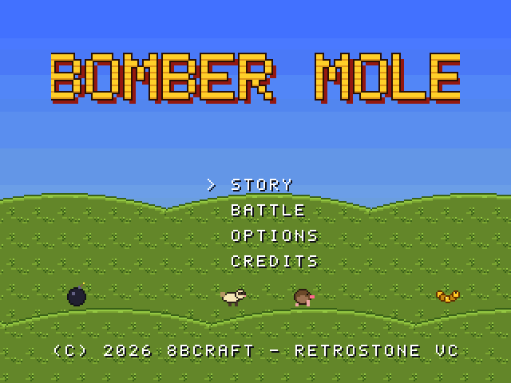
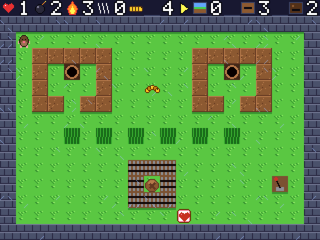
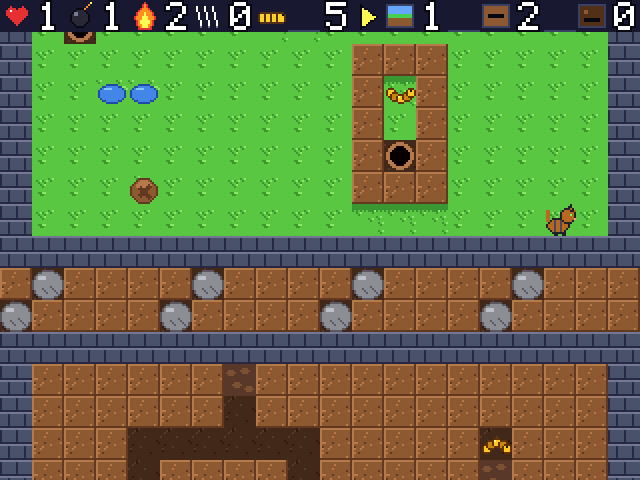
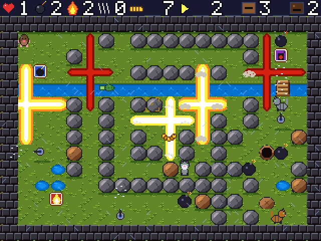
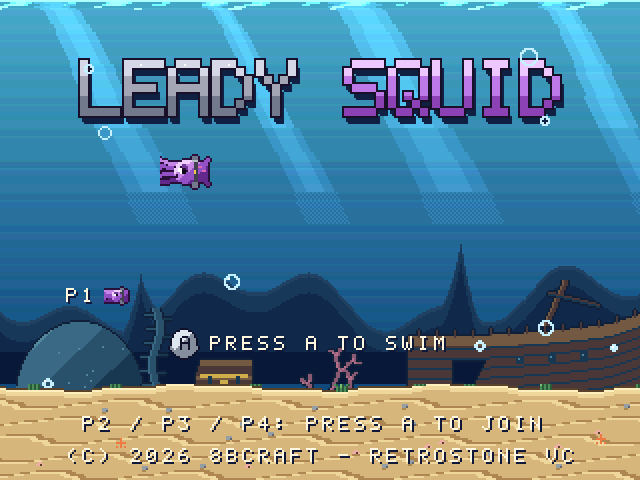
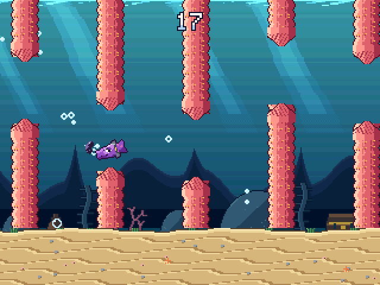

# RetroStone VC

**RetroStone VC** is a virtual console (a "fantasy console") with the feel of a Super Nintendo: 320x240 at
60 fps, RGB555 colours with 256 palette entries, four tile layers plus an affine layer, per-line raster
effects, windows and colour math, 128 sprites, 8 sample voices with ADSR and echo, tracker music, 4 SNES pads
and 32 KiB of battery RAM. The limits are **guidelines**: a game can go beyond them on purpose, and strict mode
(debug builds) warns once per kind of excess. The full specification, with how each limit maps to the real
SNES, is in [docs/spec.md](docs/spec.md).

Games are written in C11 against a small SDK and run:
- as **libretro cores** (`<game>_libretro.so`) on RetroStoneOS (the RetroStone2 handheld: Allwinner A20,
  640x480 LCD, exactly 2x) and in RetroArch;
- as **desktop programs** on Linux and Windows (SDL2);
- **headless**, for tests, screenshots and benchmarks.

The first game is **Bomber Mole** (`games/bombermole/`): you are a mole who drops bombs to open the way, on
three depths at once (the grass surface and two undergrounds), through four seasons.
Design: [games/bombermole/DESIGN.md](games/bombermole/DESIGN.md).

| Screen | |
|---|---|
|  |  |
|  |  |

More in [docs/screenshots/](docs/screenshots/).

The second game is **Leady Squid** (`games/leadysquid/`): a one-button "flap" game. A grumpy squid wearing
far too many lead diving weights jets through the gaps between kelp, coral, ship masts and anchor chains.
Design, balance sources and tuning: [games/leadysquid/DESIGN.md](games/leadysquid/DESIGN.md). Its targets are
prefixed (`games/leadysquid/game.mk`): `make leadysquid`, `make leadysquid-check`, `make leadysquid-dist`
(`dist/windows/LeadySquid.exe`, `dist/libretro/leadysquid_libretro.so` + `.armhf.so`),
`make leadysquid-screenshots`, `make leadysquid-todo` / `leadysquid-art` / `leadysquid-art-review` (the art
workflow below, with `--game leadysquid`). Keys: Z, X, Up or Enter swim; Backspace or Esc pause.

| Leady Squid | |
|---|---|
|  |  |

## Play on Windows
Build it (below) or take `dist/windows/BomberMole.exe`: a single executable, SDL2 is linked in. Double-click
it. Progress is saved in `bombermole.srm` next to the exe.

| Keyboard | Gamepad (SNES layout) | Action |
|---|---|---|
| Arrows | D-pad / left stick | move; hold toward soft dirt to dig |
| Z | B (bottom) | drop a bomb (facing a hole: toss it down) |
| X | A (right) | detonate the oldest bomb (remote detonator power-up) |
| A / S | Y / X | (unused) |
| Q / W | L / R | (level select: L+R+Select unlocks everything) |
| Enter | Start | pause menu, confirm |
| Backspace / Right Shift / Esc | Select | back; in the pause menu: resume |
| F11 or Alt+Enter, F12 | | fullscreen, screenshot (close the window to quit) |
| F1-F7 | | dev mode keys (below) |

Difficulty (Easy, Normal, Hard) is in the Options menu. Command line: `BomberMole.exe --scale 4`, `--fullscreen`,
`--opt level=spring-3` (jump to a level), `--dev` (dev mode). Levels can be edited without rebuilding: the
exe loads `games\bombermole\levels\*.txt` next to it when that folder exists (or `data\levels\`), and falls
back to the levels built in.

### Dev mode
For level work and testing. Turn it on with `BomberMole.exe --dev`, or on the title screen hold L+R (Q+W) and
press Start. Then:
- every level is unlocked in level select (Options: "DEV: ALL LEVELS" on/off);
- keys, also in a second row of the pause menu: **F1** invincible, **F2** all power-ups, **F3** skip the level,
  **F4** jump to the next depth, **F5** reload the level from its text file and restart it, **F6** show the
  hidden grubs, power-ups and the exit on the pause map, **F7** frame-time overlay (update/render ms, sprites,
  palettes, strict-mode warnings);
- the save's progress (cleared levels, best times) is never written while dev mode is on.

Workflow: run `dist\windows\BomberMole-preview.exe --dev` (a shortcut works too): with `--dev` the exe also
looks upwards from its folder (up to 4 levels: `..\..\games\bombermole\levels\` from `dist\windows`) and uses
the repository's levels; edit a level in a text editor, press F5. The F7 overlay and the console log show the
folder the level came from ("embedded" when none was found). Without `--dev` the exe uses its built-in levels
(or `games\bombermole\levels\` next to it, if you copy one there). `python3 games/bombermole/tools/check_levels.py` validates the files (solvable, no softlock).

## Build (Linux or WSL)
```
sudo apt-get install build-essential libsdl2-dev mingw-w64 gcc-arm-linux-gnueabihf python3-pil python3-numpy python3-scipy
make                 # build/host: bombermole (SDL2), bombermole_headless, bombermole_libretro.so
make check           # all tests
make dist            # dist/windows/BomberMole.exe, dist/libretro/bombermole_libretro.so (+ .armhf.so)
make windows         # only the Windows exe (downloads the SDL2 mingw package once, tools/fetch_sdl2_mingw.sh)
make armhf           # libretro core for the RetroStone2 (-mcpu=cortex-a7 -mfpu=neon-vfpv4 -mfloat-abi=hard)
make screenshots     # docs/screenshots/
make bench           # per-frame cost of the heaviest scenes + a PPU stress test
make art             # import the owner's validated art (tools/art_sync.py sync)
make preview         # dist/windows/BomberMole-preview.exe with ALL generated AI art, 24-px characters
make art-review      # the owner's art review tool on http://localhost:8765 (tools/art_review.py)
make DEBUG=1         # -O0 -g, strict mode on
make SAN=1 check     # the tests under AddressSanitizer + UndefinedBehaviorSanitizer (make clean first)
make CHAR_SIZE=24    # 24x24 characters (16 by default); ART=<dir> builds with other art
make TILESET=ai      # terrain tileset: code (default, tools/make_tiles.py), ai (the art's tiles.png) or ai_v2
```
Run: `./build/host/bombermole`, or load `bombermole_libretro.so` in RetroArch with "Start core" (no content).
Headless: `./build/host/bombermole_headless --frames 300 --opt level=spring-1 --input script.txt --shot 299:out.png
--bench` (see the file header of `sdk/frontends/headless/rs_headless.c`).

## Repository
| Path | Contents | Licence |
|---|---|---|
| `sdk/` | the SDK: `include/rs.h` (game API), `src/` (runtime, scanline renderer, audio, text, save states), `frontends/` (libretro, SDL2, headless), `tests/` (golden images, save states) | MIT, (c) 2026 Pierre-Louis Boyer (8BCraft) |
| `sdk/third_party/` | libxmp-lite 4.7.3, stb_image(_write), libretro.h | MIT / public domain, see THIRD_PARTY.md |
| `tools/` | asset tool, sheet layout, placeholders, AI sheet cutter, art sync, comparisons | MIT |
| `games/bombermole/` | the game: code, levels, art, design | all rights reserved, 8BCraft |
| `docs/` | [spec](docs/spec.md), [assets](docs/assets.md), [art sheets](docs/art-sheets.md), [art workflow](docs/art-workflow.md), screenshots, art previews | |

## Tests
`make check` runs: the SDK unit tests (renderer golden images for layers, flips, sprites, priorities, raster,
affine, colour math, text; input edges; save RAM; RNG; audio; save states), a libretro loader test (dlopen, 600
frames, video/audio/SRAM, save states and a resume before the first frame), the art tool tests (layout, placeholders, lossless tile round trip, the AI cutter on
blurred and jittered 8x copies, the art sync end to end, the consistency pass on alpha and near-magenta
strips with effects, uneven spacing and frame-count mismatches, the review tool's TODO.md writing), the level checker (format and solvability of all 32
levels), the game smoke tests (every level runs; scripted inputs walk, collect, dig, bomb, change depth, die
and restart) and the save-state tests: at 13 points of Bomber Mole (menus, levels, bombs and enemies, pause, a
depth slide, a boss, night, co-op, battles) and 6 of Leady Squid (1 and 2 players, paused, game over), save, play
on, load and play the same frames again, also in a fresh process; bad states are refused; `tools/state_audit.py`
checks that every mutable static is saved or listed as scratch. How save states work:
[docs/spec.md, "Save states"](docs/spec.md#save-states).

## Art
Placeholder art is generated by `tools/make_placeholders.py`. Real art comes from an image-generation agent
through `games/bombermole/art/incoming/TODO.md`: one PNG per animation strip, made consistent per family by
`tools/art_consistency.py`, reviewed by the owner in `tools/art_review.py`, imported by `tools/art_sync.py`.
In-game previews of the unvalidated AI art: `docs/art-preview/ingame-ai-*.png`. See
[docs/art-workflow.md](docs/art-workflow.md).
