# The 8BCraft house style (RetroStone VC games)

All 8BCraft games look and sound like one family. The reference is **Leady Squid** (games/leadysquid/:
tools/make_art.py, src/draw.c, src/sfx.c, docs/screenshots/). This guide states its rules; the kit implements
them, so a new game gets them by using it:

| Kit | What |
|---|---|
| `games/common/src/house_ui.c/.h` (`hu_*`) | C: the font, panels, banners, logo, kit sprites (digits, button glyphs, medals), pause, game over, tweens, shake |
| `games/common/src/house_audio.c/.h` (`ha_*`) | C: the synthesiser, the house sounds, the loudness targets |
| `games/common/tools/house_style.py` | Python: the palettes, Canvas, outline, shading, dither, shapes, squash and stretch, the UI sprites, the logo |
| `games/common/tools/house_music.py` | Python: the MOD writer and the house instruments |
| `tools/new_game.py ID "Name"` | a new game from `games/_template` with all of the above wired in |

Pictures (drawn by the kit): `docs/art-direction/kit-*.png` (the template's screens, by house_ui.c), `palette.png`,
`font.png`, `ui-sprites.png`, `shapes.png`, `logo.png` (by `house_style.py --out docs/art-direction`).
The reference screens: `games/leadysquid/docs/screenshots/` (title, get-ready-2-players, pause, gameover-*).

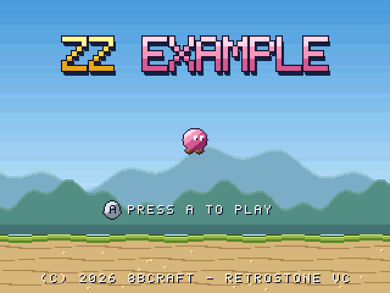 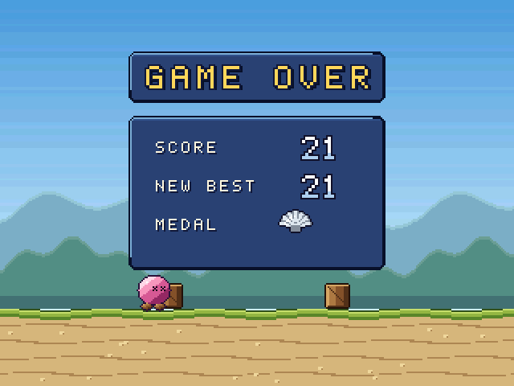

## 1. Pixel art

**Code-drawn, always.** Every sprite, tile and panorama is drawn by the game's `tools/make_art.py` with
`house_style.py`. No image generation (the art/incoming/TODO.md of a new game says so).

- **Outline: 1 px, outside the shape**, never black. Characters: their material's darkest shade pushed
  towards violet/navy (the squid `#28103a`, the template hero the same); UI sprites `#161228`; props the darkest
  shade of their material (wood `#22140c`). `Canvas.outline(c)` (4 neighbours; `diag=True` for digits).
  Background far layers have **no** outline.
- **Shading: 3-4 flat shades per material, light from the top-left** (`LIGHT_DIR = (-0.62, -0.78)`).
  `shade_nd()` picks highlight / light / mid / dark at the thresholds 0.62 / 0.18 / -0.45; `shade3()` does
  cylinders (columns, trunks: light left, dark right); `ellipse()` and `capsule()` shade round shapes.
- **Highlights:** one or two pixels of the lightest shade or white, top-left (an eye's glint, a rivet, the
  medal's shine). Never a white rim.
- **Dither:** only for fades and transparency: the checker `checker(x, y)` (ink and dust puffs fading, the
  rays' last band) and the ordered `dither_ok(x, y, level)`. Never inside a sprite's body, never on the hero.
- **Squash and stretch:** draw at rest, then `squash(cv, 1.25)` on take-off and landing (4-5 frames), `squash(cv,
  0.82)` while rising, then outline. Area is kept; the feet stay on the ground (anchor bottom). Leady Squid
  squeezes the mantle (0.8 x 1.1) on a flap.
- **Eyes:** big and readable at 1x: `eye()` 3x4 white with a 1x2 pupil looking where the hero goes; X eyes
  when hit.
- **Sizes** (screen 320x240): hero 32x32 cell (body about 18-20 px), props 16x16 or 24x16, bubbles and
  sparkles 8x8, score digits 16x16, medals 24x24, the button glyph 16x16. Obstacle/terrain tiles are 8x8
  on BG layers; a column is a multiple of 8 px wide.
- **Palettes** (the SDK: 8 BG + 8 OBJ palettes of 15 colours):

| Palette | House use |
|---|---|
| BG 0 | the UI (house_ui.c): cream, outline, panel fill/rim/highlight, gold, red, green, grey; entry 0 = the backdrop (raster gradient) |
| BG 1-4 | the playfield: ground, obstacles, one palette per theme |
| BG 5 | the title logo (per-game ramps) |
| BG 6-7 | mid-ground and far layers |
| OBJ 0 | the hero (player 1); **OBJ 1 = player 2, the same tiles with the hue rotated** (`hue_swap`, build_assets.py) |
| OBJ 2 | effects and props |
| OBJ 3 | the kit sprites (digits, glyphs, medals, sparkle) |
| OBJ 4-5 | **players 3 and 4** (the same tiles, `player_palettes`; see "Title and players") |
| OBJ 6-7 | per-game (Leady Squid: the obstacle caps, two themes at a time); only OBJ 4-7 take colour math |

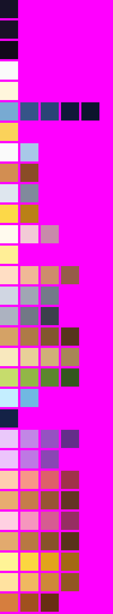 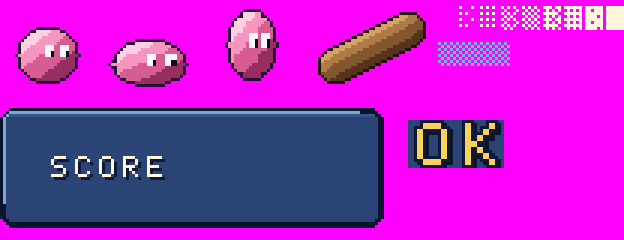

## 2. Colour language

The master ramps are in `house_style.HOUSE` (light to dark); per-game accents in `house_style.ACCENTS`.

| Ramp | Colours | Use |
|---|---|---|
| cream | `#fff6dc` | all UI text |
| ui_navy | `#78aad2 #365488 #2a4476 #101838 #0c142c` | panels (rim light, highlight line, fill, glyph outline, dark rim) |
| ui_gold | `#fad25a` | banner titles, GAME OVER |
| outline | `#161228` | UI sprites |
| digit | `#fafafa #a8c8e8` | score digits: white, the bottom two rows blue-grey |
| bronze / silver / gold / pearl | light, dark (+ pearl white) | the medal tiers, always in this order |
| skin | `#ffdec4 #f0b896 #ce8c6c #965c48` | people (Pogo Mamie) |
| lead / iron / wood / sand / leaf / water | 3-4 shades | shared materials |
| accents | squid, coral, rust (Leady Squid); pink (Pogo Mamie), beaver, duck, pancake + syrup | the game's hero and logo |

Rules: the hero is the most saturated thing on screen; backgrounds are desaturated and darker or lighter
than the playfield; UI is always cream on navy; gold means "reward".

## 3. Backgrounds

- **Raster gradient** on the backdrop (CGRAM 0 changed per line by the raster callback): sky or water,
  lighter at the top (sky) or the surface (water), with a 2-line dither step every 8 lines
  (`+4,+2,+4` on RGB8 when `y & 4`) to hide RGB555 banding. Leady Squid darkens it with the score (up to 37%).
- **Parallax**: front (BG2) 1, mid-ground (BG3) 1/2, far (BG3/BG4) 1/4, rays 1/8 with a slow per-line sway
  (`rs_bg_line_scroll`). The far layer has 2-3 low-contrast tones and no outline.
- **Light rays** (Leady Squid, optional): a BG layer of added colours (`rs_math(RS_MATH_ADD, layer)` from line 0
  to the band's end, switched off by the raster callback), slope 1/2, 3 shades fading down, checker-dithered at the tip.
- The ground band at the bottom: 48 px (20% of the screen), a 1-px dark top line, a light top row.

## 4. Typography

- The **house font** is the SDK's 5x7 (`sdk/tools/gen_font.py`), capitals only.
- **Small** (8x8 tiles): cream with a 1-px navy shadow down-right (`hu_text`); on panels the same on the fill
  colour (`hu_box_text`).
- **Big** (2x, 16x16): cream with a full 1-px navy outline over the scene (`HU_BIG_FREE`: GET READY, PAUSED);
  gold with an outline and a dark drop shadow on the panel fill (`HU_BIG_BANNER`: GAME OVER).
- Text is centred (`hu_center`); rows: logo 2-9, player slots 18, PRESS A 21, BEST 24, join line 26,
  copyright 28; PAUSED 13. Arrows: `HU_ARROW_LEFT` / `RIGHT` / `UP` / `DOWN` in a string draw an arrow (the kit
  redraws `{ } ^ ~`).

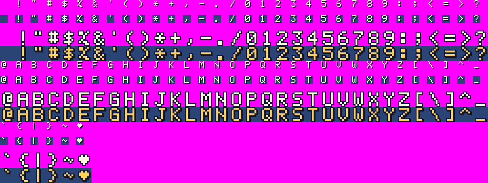

## 5. UI kit

| Screen | House layout | Kit |
|---|---|---|
| Title | the only menu (no "get ready"): the **logo** (rows 2-9), the hero bobbing under it (`hu_bob(t, 64, 4)`), the **player slots** on row 18, **PRESS A TO <VERB>** on row 21 with the **A glyph** (or the D-pad glyph) left of it (both blink, 30 frames on / 30 off), BEST n on row 24 (if > 0), the **join line** on row 26, `(C) 2026 8BCRAFT - RETROSTONE VC` on row 28 | `hu_title_setup`, `hu_title_update`, `hu_title_draw`, `hu_title_sprites` (or `hu_logo`, `hu_prompt`, `hu_glyph`, `hu_copyright`) |
| Logo | the title at 4x (3x if too long), each word a 3-shade ramp (light top band, mid, dark bottom band), 1-px outline `#1a1028` all round, navy `#142246` drop shadow 3-4 px down and half as far right (the 3D extrusion); extras per game (Leady Squid: rivets, bubbles) | `hu_logo`, `house_style.logo` |
| Join | row 26: `P2 / P3 / P4: PRESS A TO JOIN` (the free slots), then `P3 / P4: PRESS A TO JOIN - B: LEAVE`, `4 PLAYERS - B: LEAVE`; a joined player's icon pops in on its slot (row 18) with a sparkle and the confirm sound | `hu_title_*` |
| In game | the score in big digits, centred at the top (y 10); 2 players: at x 80 and 240; 3-4 players: score chips in the corners (P1 top-left, P2 top-right, P3 bottom-left, P4 bottom-right) with a P1..P4 tag; split screens: one score per view | `hu_number`, `hu_score_chip(s)`, `hu_score_tags`, `hu_split` |
| Pause | Select (and Start when it is not an action): brightness 9/15, PAUSED big on row 13, a blip | `hu_pause` |
| Game over | the **banner** (a 20x4 panel at row 4, GAME OVER in gold), the **panel** (20x12 at row 9): SCORE, BEST or NEW BEST, MEDAL (1P); both slide up 200 px in 20 frames (ease-out); `A: <VERB> AGAIN` blinks on row 19 after 36 frames | `hu_banner`, `hu_gameover_panel`, `hu_gameover_sprites`, `hu_retry_line`, `hu_slide_in` |
| Results (2-4 players) | the banner on row 3 (`P3 WINS!` or `DRAW!`), the ranking panel (24 wide from row 8): one row per place, 3 rows apart: 1ST..4TH, the tag, the hero icon, the score, the medal (1st gold, 2nd silver, 3rd bronze, ties alike; a sparkle by the winner); the retry line under it | `hu_rank`, `hu_results_panel`, `hu_results_sprites`, `hu_results_icon_pos`, `hu_retry_line_at` |
| Medals | 4 tiers at 10, 20, 30, 40: bronze, silver, gold, pearl; a sparkle blinks next to it; the medal jingle | `hu_medal`, `hu_medal_of`, `hu_sparkle` |
| Buttons | a round silver button with its letter (A, B, X, Y), 16x16, a pressed frame 1 px lower; the D-pad cross (`HU_BTN_DPAD`) | `hu_glyph` |

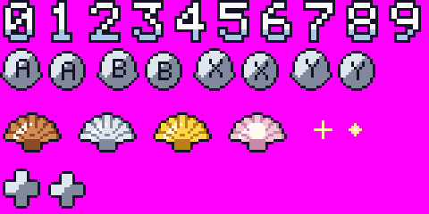 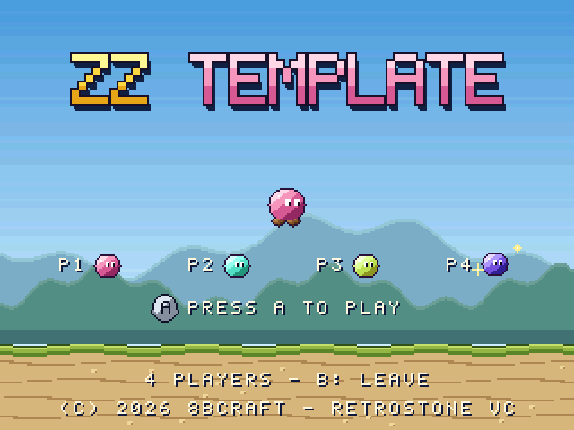
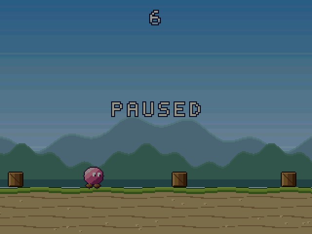 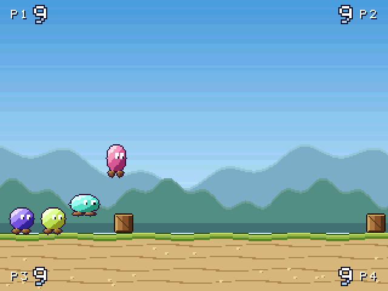
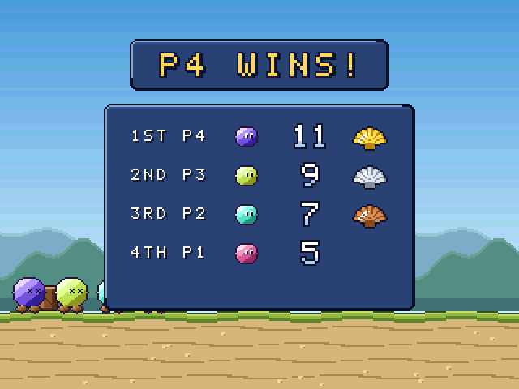

### Title and players

**No more "get ready" screen: the title is the only menu.** Up to 4 players in every game (the SDK has 4 pads).

- **Start inputs.** P1 starts the game straight from the title with the game's natural play input, set per game
  in `hu_title_cfg.start` (RS_BTN_* bits); the prompt shows the matching glyph or word, made by the kit:
  `PRESS A TO <VERB>` (A glyph), `PRESS <-/-> TO <VERB>` (Left and Right: D-pad glyph), `PRESS ANY ARROW TO <VERB>`
  (the whole D-pad: D-pad glyph). The words are in one table in house_ui.c (`words`: a translation replaces it).

| Game | Start inputs | Prompt |
|---|---|---|
| Leady Squid | A, B, X, Y, Up, Start (its swim inputs) | PRESS A TO SWIM |
| Beaver Rush | Left, Right, A, B | PRESS <-/-> TO GNAW |
| Duck Parade | the D-pad, A | PRESS ANY ARROW TO HOP |
| Pogo Mamie | the D-pad, A | PRESS ANY ARROW TO BOUNCE |
| Pancake Tower | A | PRESS A TO DROP |
| Blueberry Tumble | A, Up | PRESS A TO ROLL |

- **Join and leave on the title.** Pads 2-4 join with A (or Start), leave with B. Players are numbered in the order
  they joined (P1 is always pad 1; `hu_player_pad(p)` maps a player to its pad); the lobby stays between runs.
  Each joined player's icon (the hero in its palette, drawn by the game's callback) pops up on its slot (row 18)
  with a 10% overshoot and two sparkles; the game plays its join sound (house: `HA_CONFIRM`). Row 26 lists the
  free slots: `P2 / P3 / P4: PRESS A TO JOIN`.
- **After a game over**, one press retries at once with the same players (straight into play: instant retry);
  Select goes back to the title (to join or leave).
- **The four palettes** (`house_style.player_palettes`, `hu_player_pal`): P1 the hero's own palette (OBJ 0);
  P2 the game's `hue_swap` of the hero's main material (OBJ 1, as before); P3 and P4 (OBJ 4 and 5) the same
  material rotated to the two hues farthest from P1's and P2's on the colour wheel (on a 1/72 grid, so the four
  main colours stay apart); outline, eyes, skin, metal and white highlights never change. The UI stays cream on
  navy: the hero icon next to a tag is the player's colour. Example (the template's pink hero):

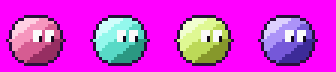

- **HUD.** 1-2 players as before; 3-4 players on a shared screen: score chips in the corners (`hu_score_chip`,
  `hu_score_tags` once, `hu_score_chips` each frame). Split screens (`hu_split`): 2x2 quadrants (`HU_SPLIT_QUAD`)
  or 4 columns (`HU_SPLIT_COLUMNS`, 78 px each, the full height) with 2-px dividers; each view draws its sprites
  between `hu_view_oam_begin` and `hu_view_oam_end`.
- **Results** for 2-4 players: `hu_rank(&s, n, key, value)` (the key ranks: the score, how long a player lasted...;
  equal keys share a rank), `hu_results_panel(&s, NULL)` (the banner names the winner, or DRAW!),
  `hu_results_sprites(&s, t, slide)`, the game's hero icons at `hu_results_icon_pos`, the retry line at
  `hu_results_retry_row`.
- **Adopting it** (a game with the old flow): drop `hu_get_ready` and `hu_join_line` (deprecated, still built;
  `-DHU_WARN_DEPRECATED` lists the calls), call `hu_title_setup` after `hu_init`, `hu_players_set(n)` for
  `--opt players=N`, `hu_title_update()` every title frame (P1's `HU_TITLE_START` starts the run, its press may
  also be the first move), `hu_title_draw(t, best)` and `hu_title_sprites(t, icon, user)`; read each player's
  pad through `hu_player_pad(p)`; draw player p in `hu_player_pal(p)`. `games/_template` shows the whole flow.

## 6. Motion

- 60 Hz fixed step, integer maths only (Q16 positions): every run is deterministic.
- **Tweens** (`hu_ease_*`): ease-out quad for things arriving (the game-over panel: 200 px in 20 frames),
  ease-in for things leaving, `hu_ease_back` (10% overshoot) for a medal or a banner popping in. UI moves in
  12-20 frames, never more than 30.
- **Blink**: 30 frames on, 30 off (`hu_blink`). **Bob**: a triangle wave, 64 frames, +-4 px (`hu_bob`).
- **Hit**: a hit-stop of 8 frames, then the fall. **Screen shake** only on a hit or a crash: at most 4 px, at
  most 16 frames, decaying, on the playfield layers and world sprites, never on the UI (`hu_shake(3, 12)`).
- The game-over panel waits 30-40 frames after the hero stops; the retry button is locked 36 frames.

## 7. Audio

- **Effects are synthesised at start-up** (`house_audio.c`, from Leady Squid's sfx.c): integer sines with a
  pitch sweep, a 3-ms attack, a hyperbolic decay and a 12-ms release (`ha_tone`), low-passed noise with a
  squared fade (`ha_hiss`), 32 kHz mono samples. The house set (`ha_init`, `HA_*`): CONFIRM (C5-G5),
  PAUSE (A4 to E4), MEDAL (C7 E7 G7), GAMEOVER (a swish and G4 Eb4 C4), SWISH, DING (G6 bell), SELECT, THUD.
  A game adds its own (Leady Squid: bloop, clank) with the same functions.
- **Music**: a 4-channel ProTracker MOD written by `tools/make_music.py` with `house_music.py`, played by
  libxmp-lite (`rs_music_play`). The house instruments: a soft sine **pad** (vol 22), a round **bass** (40),
  a water-drop **pluck** (34), a breathy **lead** (20); channels 0 arpeggio, 1 bass, 2 pad, 3 lead;
  64-row patterns, a loop of 3-4 patterns; speed 8 for calm games (Leady Squid, D dorian), 5-6 for action.
- **Loudness** (every game the same): music `rs_music_volume(56)` (`HA_MUSIC_VOL`); effects `rs_sfx` volume
  110 for a crash, 88 for the main action, 70 for feedback and UI, 50 for soft ones; echo `rs_echo(110, 35, 30)`,
  on the "wet" sounds only (the score ding, water). Pan by screen x: `24 + x * 80 / 320`.

## 8. Conventions

- **One button, instant retry**: A (and B, X, Y, Up) acts; the game's start inputs start it from the title; on
  the game-over panel one press starts the next run at once (Select: back to the title).
- **The best score in save RAM**: a struct with a 4-letter magic, a version and a checksum, written at each
  game over (`rs_sram_commit`); never part of a save state.
- **Players 2-4** join with A on their pad on the title (B leaves); the same hero in the house palette swaps
  (OBJ 1, 4, 5); all play at once; the results rank them (see "Title and players").
- **Save states**: every mutable static is registered (`rs_state_var`) or listed in `state_audit.txt`; the kit
  registers its own (`hu_state()`, `ha_state()`).
- **Credits line**: `(C) 2026 8BCRAFT - RETROSTONE VC` on the title.
- **Windows README**: `games/_template/dist/README-windows.txt` (title line, licence line, pitch, run, the
  controls table pad/keyboard, 2 players, F11/F12, options, the .srm).
- **Tests**: `make <game>-check` = libretro loader, smoke (flow, pause, save, 2P, the bot hook, determinism),
  the UI screens, save states and their audit (`make template-check` proves the template).
- **Licence**: code MIT, assets CC BY-NC-SA 4.0 (games/<game>/LICENSE), names and logos not licensed.

## 9. A new game

```
python3 tools/new_game.py pogomamie "Pogo Mamie"      # games/pogomamie/, art drawn
make pogomamie-check                                  # build and test
make pogomamie                                        # build/host/pogomamie (SDL2)
```
An existing game opts in with `HOUSE_UI_<game> = 1` in its game.mk (the Makefile then compiles
`games/common/src/*.c` into it and adds `-Igames/common/src`), calls `hu_init()` in its draw init, `hu_state()`
and `ha_state()` from its state callback, and lists `$(HOUSE_SRC)` objects in its state audit.
